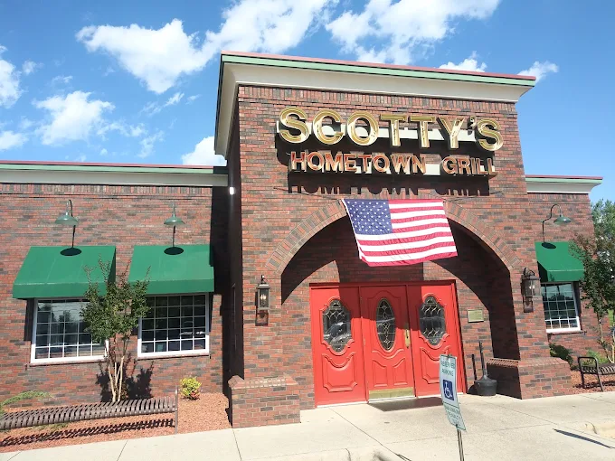

# restoran!doctype html>
<html lang="en">
<head>
<meta charset="utf-8" />
<meta name="viewport" content="width=device-width,initial-scale=1" />
<title>Scotty's Hometown Grill — Elevated Comfort Food, Taylorsville NC</title>
<meta name="description" content="Family-owned American grill in Taylorsville, NC. Southern breakfast, hand-cut steaks, burgers, wings and homemade pies." />
<link rel="preconnect" href="https://fonts.googleapis.com">
<link rel="preconnect" href="https://fonts.gstatic.com" crossorigin>
<link href="https://fonts.googleapis.com/css2?family=Playfair+Display:ital,wght@0,400;0,600;1,400&family=Inter:wght@300;400;500&display=swap" rel="stylesheet">

</head>
<body class="bg-cream text-ink">

<<header class="fixed top-0 inset-x-0 z-50 backdrop-blur-md bg-[rgba(40,20,22,.75)] border-b border-white/10">
  

    <a href="#top" class="flex items-center gap-2 text-cream">
      Scotty's
      Hometown Grill
    </a>
    <nav class="hidden md:flex items-center gap-8 text-sm text-cream/80">
      <a href="#story" class="hover:text-gold">Our Story</a>
      <a href="#menu" class="hover:text-gold">Menu</a>
      <a href="#home" class="hover:text-gold">Our Home</a>
      <a href="#reviews" class="hover:text-gold">Reviews</a>
      <a href="#visit" class="hover:text-gold">Visit</a>
    </nav>
    <a href="#reserve" class="hidden sm:inline-flex px-5 py-2 text-[10px] tracking-[0.2em] uppercase border border-gold text-gold hover:bg-gold hover:text-burgundy transition">Reserve</a>
  

</header>

<section id="top" class="relative h-screen min-h-[680px] overflow-hidden">
  
  

  

    

      
Taylorsville · North Carolina

      <h1 class="font-display text-cream text-5xl md:text-7xl lg:text-8xl leading-[0.95]">Comfort food, elevated.</h1>
      
A family table set since day one — Southern soul on the plate, candlelight in the room, and the kind of welcome that keeps a town coming back.

      

        <a href="#reserve" class="px-8 py-4 bg-gold text-burgundy text-[11px] tracking-[0.25em] uppercase font-medium hover:bg-cream transition shadow-elegant">Reserve a Table</a>
        <a href="#menu" class="px-8 py-4 border border-cream/40 text-cream text-[11px] tracking-[0.25em] uppercase hover:bg-white/10 transition">Order Online</a>
      

    

  

  

    ★ 4.4 · 1,765 reviews
  

</section>

<section id="story" class="py-28 md:py-40 bg-cream">
  

    

      
      

        
Est. a long time ago,

        
still family-run

      

    

    

      
Our Story

      <h2 class="font-display text-4xl md:text-5xl leading-tight">A neighborhood table, set with care.</h2>
      

      
Scotty's began as a small-town diner with a simple promise — food made the way grandma made it, served by people who remember your name and your order.

      
Years later, that promise still holds. The pies are still hand-rolled before sunrise, the steaks are still hand-cut, and the coffee pot is still always on.

      

        

1,765

Reviews

        

4.4★

Rating

        

6 AM

Doors open

      

    

  

</section>

<section id="menu" class="py-28 md:py-40 bg-[#efe7d4]">
  

    

      
The Menu

      <h2 class="font-display text-4xl md:text-6xl">Signature plates</h2>
      

      
From sunrise breakfast to candlelit dinner — every plate is made in-house, every day.

    

    

    

      <a href="#reserve" class="inline-block px-10 py-4 bg-burgundy text-cream text-[11px] tracking-[0.25em] uppercase hover:bg-black transition">Order Online</a>
    

  

</section>

<section id="home" class="py-28 md:py-40 bg-cream">
  

    

      
Our Home

      <h2 class="font-display text-4xl md:text-6xl">30 Buffett Blvd</h2>
      

      
The same brick building, the same green awnings, the same red doors — welcoming neighbors for generations.

    

    

      
      

        
Come as a stranger, leave as family.

      

    

  

</section>

<section id="reviews" class="py-28 md:py-40 bg-burgundy text-cream">
  

    
Word of Mouth

    
★★★★★

    <blockquote id="quote" class="font-display italic text-3xl md:text-5xl leading-[1.2] min-h-[180px]"></blockquote>
    

      

      

    

    

      <button onclick="rev(-1)" class="w-12 h-12 rounded-full border border-cream/30 hover:bg-white/10">‹</button>
      

      <button onclick="rev(1)" class="w-12 h-12 rounded-full border border-cream/30 hover:bg-white/10">›</button>
    

  

</section>

<section class="py-20 bg-[#efe7d4]">
  

    

👶

Kids menu

    

♿

Accessible

    

🚗

Free parking

    

💳

Contactless

    

🌿

Vegetarian

    

🍽️

Dine · Takeout

  

</section>

<section id="visit" class="py-28 md:py-40 bg-cream">
  

    

      
Reserve · Order · Visit

      <h2 class="font-display text-4xl md:text-5xl leading-tight">Pull up a chair.We saved you one.</h2>
      

      

        

Find us

30 Buffett Blvd Taylorsville, NC 28681

        

Call ahead
<a href="tel:+18286355635" class="hover:text-burgundy">+1 (828) 635-5635</a>

        

Hours

Breakfast · 6 – 11 AM daily Lunch & Dinner · 11 AM – 10 PM daily

      

      <form onsubmit="event.preventDefault();location.href='tel:+18286355635'" class="space-y-4 bg-white p-8 shadow-elegant border border-ink/10">
        
Request a table

        

          <input placeholder="Your name" class="w-full bg-transparent border border-ink/15 px-4 py-3 text-sm focus:outline-none focus:border-gold" />
          <input placeholder="Phone" type="tel" class="w-full bg-transparent border border-ink/15 px-4 py-3 text-sm focus:outline-none focus:border-gold" />
          <input placeholder="Date" type="date" class="w-full bg-transparent border border-ink/15 px-4 py-3 text-sm focus:outline-none focus:border-gold" />
          <input placeholder="Guests" type="number" min="1" value="2" class="w-full bg-transparent border border-ink/15 px-4 py-3 text-sm focus:outline-none focus:border-gold" />
        

        <textarea placeholder="Anything we should know? (allergies, occasion…)" rows="3" class="w-full bg-transparent border border-ink/15 px-4 py-3 text-sm focus:outline-none focus:border-gold resize-none"></textarea>
        <button type="submit" class="w-full py-4 bg-burgundy text-cream text-[11px] tracking-[0.25em] uppercase hover:bg-black transition">Reserve My Table</button>
      </form>
    

    

      

        <iframe title="Map" src="https://www.google.com/maps?q=30+Buffett+Blvd,+Taylorsville,+NC+28681&output=embed" class="w-full h-full" loading="lazy"></iframe>
      

    

  

</section>

<<footer class="bg-burgundy text-cream pt-20 pb-10">
  

    

      
Scotty's

      
Hometown Grill

      
Family-owned. Family-loved. Serving Taylorsville with elevated comfort food, three meals a day.

    

    

      
Visit

      
30 Buffett Blvd Taylorsville, NC 28681 <a href="tel:+18286355635" class="hover:text-gold">+1 (828) 635-5635</a>

    

    

      
Follow

      

        <a href="#" class="w-10 h-10 border border-cream/30 flex items-center justify-center hover:bg-gold hover:text-burgundy">IG</a>
        <a href="#" class="w-10 h-10 border border-cream/30 flex items-center justify-center hover:bg-gold hover:text-burgundy">FB</a>
      

    

  

  

    
©  Scotty's Hometown Grill. All rights reserved.

    
Made with love in Taylorsville, NC

  

</footer>

</body>
</html>
